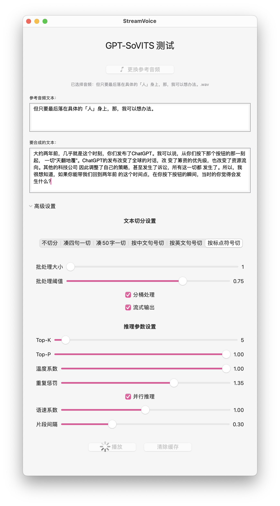

# StreamVoice - GPT-SoVITS 语音合成客户端

StreamVoice 是一个基于 SwiftUI 的 macOS 应用，为 GPT-SoVITS 语音合成引擎提供图形界面，支持实时语音合成和流式音频输出。


## 功能特点


## 系统要求
- macOS 12.4 或更高版本
- 需要本地运行 GPT-SoVITS 服务(启动`go-api.command`)

## 运行说明
1. 在 GPT-SoVITS 项目目录中找到 `go-api.command` 文件
2. 双击运行该文件，它会：
   - 检查并安装必要的 ffmpeg
   - 激活 Python 运行环境
   - 启动 v2 版本的 API 服务

`go-api.command` 文件内容：
```
#!/bin/bash

# 检查 ffmpeg 是否已安装
if command -v ffmpeg >/dev/null 2>&1; then
    echo "ffmpeg 已安装."
else
    echo "ffmpeg 未安装."
    echo "安装 ffmpeg..."
    brew install ffmpeg  
fi

set -e

SCRIPT_DIR="$(cd "$(dirname "${BASH_SOURCE[0]}")" &>/dev/null && pwd)"

cd "$SCRIPT_DIR"

source "./runtime/bin/activate"

echo "乐"

"./runtime/bin/python3" api_v2.py
```
## 支持
欢迎贡献代码或提出反馈！
